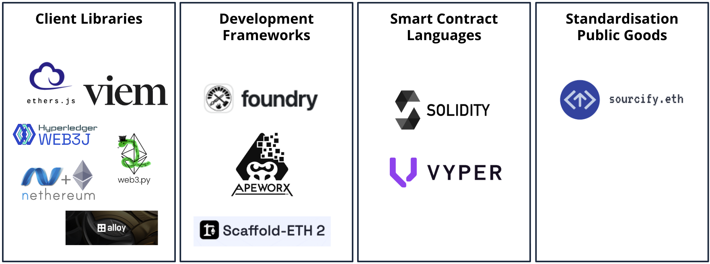

# Dev Tools Guild launch

***TL;DR**: The Dev Tools Guild unites critical Ethereum developer tooling to collectively fund projects and their maintainers (think Protocol Guild but for dev tooling), and boost coordination between protocol and dev tools developers. Coordinated by [Conor Svensson](https://x.com/ConorSvensson) (founder) and [Andrew B Coathup](https://x.com/abcoathup), starting with a one-year pilot.*

**Mission: accelerate Ethereum app development through world-class tooling.**

The Dev Tools Guild is a coordinated initiative uniting the teams behind many of Ethereum’s most widely used developer tools. Whether you're writing smart contracts, building trading bots, or deploying consumer apps, chances are you’re relying on infrastructure maintained by guild members.

<!-- truncate -->

## Why a Guild

Foundational developer tools are at times underfunded, siloed, or disconnected from protocol development. The Dev Tools Guild exists to raise the tide by **improving alignment, increasing visibility, and ensuring long-term sustainability across the ecosystem**.

Our goals:

* **Fund critical infrastructure**. Many of the tools developers rely on are built and maintained by small, focused teams or a single individual. The guild exists to ensure that foundational work is sustainably supported and aligned with Ethereum’s long-term growth.  
* **Connect app developers to core protocol discussions**. The guild works to bridge the gap between core protocol development and the application layer, helping app developers stay informed about upcoming protocol changes that may affect them, and surfacing developer sentiment to protocol contributors when it can help guide decision-making.  
* **Increase coordination and accountability**. The guild facilitates coordination across tooling teams by enabling visibility into roadmaps, encouraging cross-project knowledge sharing, and providing funders and the community with a clearer signal of where meaningful progress is being made.

## Who’s Involved

The Dev Tools Guild is kicking off with a one-year pilot to align efforts, test ideas, and build a stronger foundation for the future. Participating individuals & projects maintain core dev tools across the stack:

* **Smart contract languages** – [Solidity](https://soliditylang.org/) & [Vyper](https://vyperlang.org/)  
* **Client libraries** – [alloy](https://alloy.rs/), [ethers.js](https://ethers.org/), [Nethereum](https://nethereum.com/), [viem](https://viem.sh/), [web3.py](https://web3py.readthedocs.io/) & [Web3j](https://docs.web3j.io/)  
* **Frameworks and developer environments** – [Ape](https://docs.apeworx.io/ape/stable/userguides/quickstart.html), [Foundry](https://getfoundry.sh/) & [Scaffold-ETH](https://scaffoldeth.io/)  
* **Standardization tooling** – [Sourcify](https://sourcify.dev/)

These projects support critical parts of Ethereum’s developer ecosystem and the Dev Tools Guild launch is a step toward deeper coordination and long-term impact.

## Guild Coordinators

The Dev Tools Guild aspires to be both an open-source funding mechanism and serve a collaboration function within the ecosystem. Neither are possible without dedicated coordinators. Meet our two Guild Coordinators:

#### Conor Svensson

Conor is the founding Guild Coordinator and has been working in a variety of roles for the past year to establish the guild. He was inspired by [Trent](https://x.com/trent_vanepps)’s work creating the [Protocol Guild](https://www.protocolguild.org/) and his ideas on [guild structures](https://trent.mirror.xyz/MsXtV_TGZHp05FN_qmzeT8bBc1lRghR3Y0TPvAd-WrA) as a collective funding mechanism for the Ethereum protocol.

In 2016 he authored the [Web3j](https://github.com/LFDT-web3j/web3j) Java and Android integration library for Ethereum, and the challenges he experienced with sustaining the project have been a key motivation for his work on the guild.  In addition to the guild, he is working on improving UX and security for users in Ethereum via the [Enscribe](https://www.enscribe.xyz/) smart contract naming and verification service, which he founded along with [Web3 Labs](https://www.web3labs.com/).

Reach out to [Conor](https://x.com/ConorSvensson) if you’d like to financially support the guild, or have any other questions.

#### Andrew B Coathup

[Andrew](https://x.com/abcoathup) recently joined as our second Guild Coordinator, to assist with coordination between protocol and dev tools developers, as well as keeping the community informed of guild member tooling updates.   
   
He follows Ethereum protocol development and has a passion for sustainable open-source software and education.  He is a moderator of Eth Magicians, was previously the editor of Week in Ethereum News, and before that, community manager at OpenZeppelin.

## What's Next

Over the coming months, the guild will:

* **Be a resource to app developers** by publishing the latest tooling and protocol updates that impact Ethereum app development  
* **Be a resource to Ethereum core devs and researchers** by surfacing guild member sentiment when it can best inform roadmap decisions  
* **Be a resource to member projects** by helping to keep the lights on and providing a venue for transparency and collaboration

## Credits

A thank you to [Trent](https://x.com/trent_vanepps), [Cheeky](https://x.com/cheekygorilla0x) and the [Protocol Guild](https://www.protocolguild.org/) for their advice, inspiration, and support from Day 1\. 

Thanks also to [Kevin](https://x.com/owocki), [Sejal](https://x.com/sejal_rekhan), and [Sov](https://x.com/sovereignsignal) for connecting many of the teams together to kickstart the pilot, and finally [Marc](https://github.com/wolovim) for all his support on strategy and sharpening the guild for launch. 

## More info

Website: [devtoolsguild.xyz](http://devtoolsguild.xyz)  
Socials: [@devtoolsguild](https://x.com/devtoolsguild)  
Donate: [donate.devtoolsguild.eth](https://etherscan.io/address/donate.devtoolsguild.eth)

# Quotes

*For Ethereum to scale beyond enthusiasts and into mainstream enterprise use, its tooling layer must be robust, maintained, and aligned. The Dev Tools Guild tackles that challenge head-on. At the EEA, we’ve backed open-source infrastructure through public goods donations and are excited to see this coordinated effort take shape. It fills a key gap between protocol evolution and real-world deployment.*

\- **[Redwan Meslem](https://x.com/RedoudouM) (Executive Director, Enterprise Ethereum Alliance)**

---

*Ethereum runs on Open Source. Developers spend countless hours using Developer Tools. The Dev Tools Guild brings the best Ethereum Developer Tools together so organizations can support vital projects their developers use every day and make Ethereum great.*

\- **[awkweb](https://x.com/awkweb) (Viem/Wagmi co-maintainer)**

---

*I’m always excited to see new ways to help fund public goods, so I can’t wait to see DTG in action. When ethers started 9 years ago, I never imagined I could make open-source development a full-time career. Strong and consistent funding can be difficult for grassroots projects to acquire, in a credibly neutral way — especially as we don’t have dedicated marketing and comms teams to support us. A lot of amazing projects we all depend on in the space are in similar situations, so having a dedicated (and expertise-aligned) guild-like entity to assist should help us all shine. ♥️*

\- **[Ricmoo](https://x.com/ricmoo) (ethers.js)**

---

*Solidity has always been central to Ethereum development, and now as part of Argot— a new collective of open source infrastructure teams including Solidity and Sourcify—we’re no longer under the EF umbrella and will be diversifying our funding sources. Initiatives like the Dev Tools Guild are essential to ensuring the long-term sustainability of the tools Ethereum depends on. DTG offers a meaningful way for the community to give back to the critical developer infrastructure that underpins countless successful projects.*

\- **Nikola (Solidity at Argot)**

---

*The Dev Tools Guild isn't about building the fanciest new hammer. It's about getting all the best builders in a room, the real nerds who pour all their energy into the code, not the pitch deck, and making sure our collective toolbox is so damn good, so forkable, that builders can all stop worrying about the tools and get back to the hard part: shipping amazing things that people actually use. We're paving the cowpaths, abstracting the complexity, so any builder with a great idea can just get in there and start building.*

\- **[Austin Griffith](https://x.com/austingriffith) (Scaffold-ETH)**

---

*The Ethereum ecosystem is built on open-source foundations, yet the challenge of sustainably funding FOSS remains unresolved. Without ongoing support, there is a risk not only of losing essential tools but also of compromising Ethereum’s credible neutrality. This is where DTG plays a key role. It funds critical software that Ethereum projects and businesses rely on and encourages a culture of shared responsibility. More than a funding mechanism, DTG serves as a gathering space where diverse projects can align, share knowledge, and move forward together. Ethereum has always been at the frontier of experimentation, where new ideas take root and grow. DTG continues this tradition by exploring new models of funding, governance, and collective coordination.*

\- **[Kaan](https://x.com/kaanuzdogan) (Sourcify at Argot)**

---

*The Ethereum ecosystem's greatest asset is its unparalleled developer tooling. Our developer tooling makes it possible for developers to build the most innovative and interesting projects on Ethereum first, exploring new ideas years before they get copied on other chains. If you believe in Ethereum as an economic engine for social good, it's a no brainer to support what makes it truly great: developers.*

\- **[fubuloubu](https://x.com/fubuloubu) (Ape Framework)**

---

*A Dev Tools Guild for Ethereum is essential to ensuring the long-term sustainability, reliability, and quality of the infrastructure that underpins the entire ecosystem. Developer tooling often runs quietly in the background, but is mission-critical. The guild plays a vital role in identifying high-impact tools, supporting the maintainers who build and maintain them, and accelerating coordination across projects.*

\- **Keri Clowes (web3.py)**

---

*Ten years ago, we showed that independent, open, and agnostic people from all over the world—each with different skills—could come together to help bring Ethereum to everyone. The Ethereum vision inspired many of us, showing how it could change the world. To support that vision, over these years some of us started building the tools that would help Ethereum grow in our own domains or new areas. Today, it is truly amazing to see how much it has been achieved, and how many developers now build on Ethereum.*

*In the early days, with only a handful of projects, collaboration came naturally, all being part of a great community. We tracked each other’s progress on GitHub, had quick chats when needed, and could easily align on new features and integrate them across our toolsets.*

*But as Ethereum grew, collaboration became harder—and funding even more so for projects that remain open source, independent, agnostic and aligned with Ethereum vision. Despite many funding experiments, sustaining this work has meant for many going unpaid for long stretches, self funding and operating without a safety net. We have even seen valuable projects disappear as a result.* 

*The Dev Tools Guild can change that. It provides a solution that brings the ecosystem together—funding the builders to continue to work independently, but aligning our tools with each other and the protocol. Most importantly giving developers and businesses the confidence that they can use our solutions to help them build on Ethereum, now, and rely on them in the future, ensuring that their investment is safe, without being locked into the changes of the business model of a single company.*

*By developers, for developers—bringing the love of Ethereum to everyone.*

\- **[Juan Blanco](https://x.com/juanfranblanco) (Nethereum)**

---

*When I created Web3j in 2016, it was out of necessity — there was no way for Java and Android developers to build on Ethereum. Like many open-source maintainers, I kept it going however I could, motivated by sheer belief in the ecosystem. The Dev Tools Guild exists to change this narrative. This isn’t just for Web3j, but for all the teams quietly powering Ethereum’s growth. We’re building a future where critical tools aren’t just surviving, but thriving, ensuring the continued success of the apps on Ethereum.*

\- **[Conor Svensson](https://x.com/ConorSvensson) (Author of Web3j & Founding Dev Tools Guild Coordinator)**
