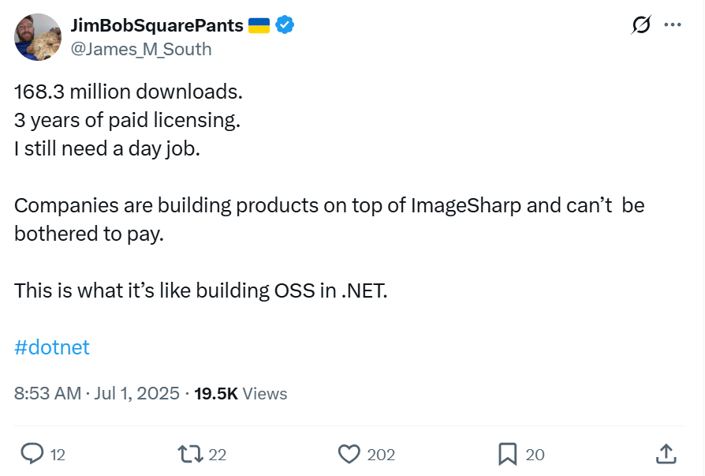
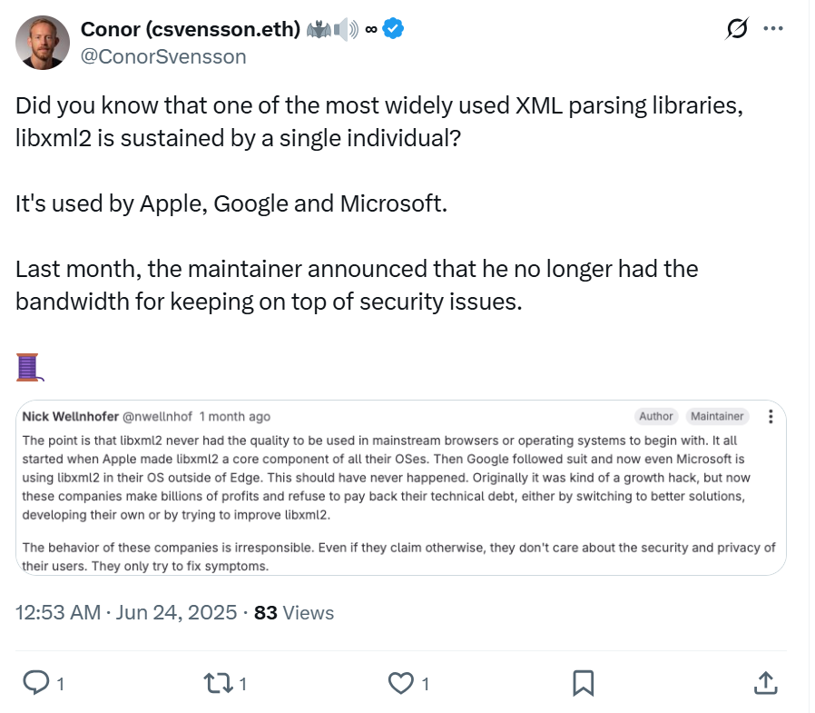

# Funding the Foundations - Why Web3 Needs a Better Model for Open Source

Open source has powered the internet since the beginning, but the people building and maintaining it have often been left behind.

<!-- truncate -->

   

[https://x.com/James\_M\_South/status/1939819673731964996](https://x.com/James_M_South/status/1939819673731964996)

It’s an old story. A tool gets millions of downloads. Entire companies depend on it. And yet its creator can’t afford to work on it full-time, because there’s no sustainable business model for maintaining the infrastructure that others build on. In web2, we’ve seen this play out repeatedly, and it’s created real fragility in the software ecosystem.

[https://x.com/ConorSvensson/status/1937162211828306055](https://x.com/ConorSvensson/status/1937162211828306055)

   
Web3 was supposed to be different. The promise of decentralized value flows, transparent incentives, and community-driven support gave many of us hope that we could finally fix open source funding. But so far, we’re still relying on the same short-term grant rounds, donation campaigns, or founder passion projects that can’t scale or be properly sustained.

At the Dev Tools Guild, we believe Ethereum has a real shot at changing this. And it starts with funding the developer tooling that makes everything else possible.

## Why Tooling Matters

Ethereum’s success as a platform doesn’t just come from the protocol, it comes from its usability. Smart contract languages like Solidity and Vyper, libraries like ethers.js, viem, web3.py and Web3j, frameworks like Foundry and Scaffold-ETH, and verification tools like Sourcify form the backbone of the Ethereum developer experience.

These tools provide cutting-edge developer experiences, unmatched in other blockchain ecosystems, thanks to their maturity and significant user base. They also span the widest number of technology stacks, ensuring Ethereum development is accessible for web app developers, data scientists, mobile developers and enterprise.

These tools are foundational. But many are still maintained by small teams or even solo devs. If we want Ethereum to be robust, scalable, and usable by the next wave of developers and users, we need to continually invest in the tools they depend on.

Providing sustainable funding for these projects is only part of the story. Our vision of the guild is one where the incentives for working on critical dev tooling are such that new developers will be attracted to these ecosystems due to these incentives.

Additionally, by having the major dev tooling projects all within the guild we can foster greater collaboration and communication between teams, with a view to creating better alignment between different projects and ensuring that greater cohesion can be established between dev tooling projects and the protocol layer too.

That’s why we launched the Dev Tools Guild. Whilst heavily inspired by the success of the Protocol Guild, we’re bringing together the teams behind the tools and aligning funding around long-term sustainability and ecosystem alignment.

## A Better Model

There is more at stake for projects building on web3 then web2. Dapps, protocols and the blockchain they are deployed to secure millions of dollars of assets. Vulnerabilities and exploits that are swiftly dealt with can be the difference between solvency and bankruptcy for a project or network.

In web2 the closed nature of software and the businesses that produce them provides a degree of protection, whereby the honeypot for attackers is datasets that can be sold on the dark web or have ransom demands placed upon them.

This creates different incentives for supporting open source software in web2 versus web3. Web2 business can temporarily shut up shop, pause operations or shut bad actors out. Hence they have workarounds they can use should there be critical issues with open source software they partially rely upon.

We do not have this luxury in web3.

Much of the current landscape of web3 funding for open source relies upon one-off grants or short-lived bounties. What if instead we could provide predictable, long-term support for open source maintainers?

What if a small slice of protocol or staking revenue was redirected toward funding key infrastructure like developer tools?

There are parallels with what Protocol Guild achieved with their 1% pledge, where they request treasuries donate 1% of their treasury to the guild. This has been very successful, raising millions in contributions.

We believe the willingness shown by protocol treasuries to support the protocol could be extended to staking and applied to dev tooling, helping ensure that builders across the stack are supported.

Such a model could radically reduce the need for constant fundraising. It would let maintainers plan for the long term, collaborate more deeply across projects, and invest in making their tools even better for everyone, from first-time dapp developers to enterprise teams.

## The Road Ahead

Our immediate focus is securing near-term grants to fund member projects and coordinators, while we lay the groundwork for more durable mechanisms.

We’re also building connections between the application and protocol layers. Tooling teams often sit at the intersection of user experience and protocol complexity. By helping developers stay informed about upcoming changes, and surfacing developer sentiment back to core devs, we can make Ethereum more cohesive, responsive, and developer-friendly.

In the longer term, we hope the Dev Tools Guild can become a key layer of the Ethereum ecosystem: a place where critical dev tooling is sustainably maintained, where new contributors can be onboarded, and where aligned projects can coordinate around shared goals.

## Support the Dev Tools Guild

If you care about Ethereum’s future, you should care about how it’s built. Not just the protocol, but the tools that make it usable.

Supporting the Dev Tools Guild means supporting the teams who maintain the foundations of Ethereum development. It means helping build a more resilient and inclusive open source ecosystem. And it means working toward a world where open source developers are no longer forced to choose between sustainability and service.

We’re optimistic that Ethereum can do what web2 couldn’t: fund the public goods it relies on. Let’s make it happen.  