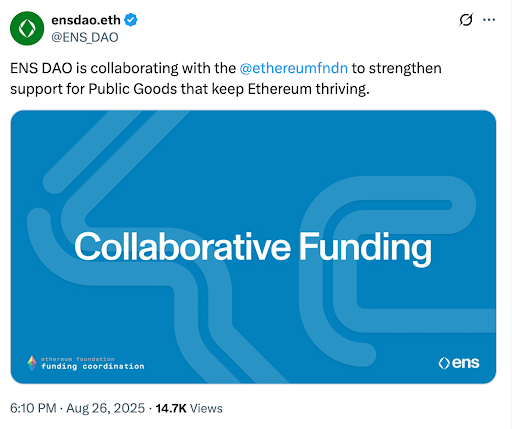
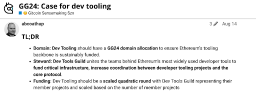

# Why the Future of Funding is Coordinated

When we set out to establish the Dev Tools Guild, one of our core beliefs was that the funding landscape for Ethereum’s open-source infrastructure has historically been too fragmented.

Funders have tended to spin up siloed programs, often designed to incentivise building around their own tokens. Developers in turn have had to apply individually to each of these programs, navigating different requirements, timelines, and expectations.

This approach is inefficient for everyone. Funders spend significant time reviewing overlapping applications, while projects are forced to divert attention away from building in order to chase multiple, often small, grants.

<!-- truncate -->

## Enter the Guild

The Dev Tools Guild was created to streamline this process for both projects and funders. Inspired by the success of [Protocol Guild](https://www.protocolguild.org/), which proved the power of collective funding for core protocol contributors, the Dev Tools Guild brings the same model to critical Ethereum developer tooling.

By pooling resources and directing them collectively, the Guild reduces the fundraising burden on individual teams and ensures that builders can focus on what they do best: maintaining and improving the tools that developers rely on every day.

This coordination isn’t just happening among builders. Increasingly, funders themselves are recognising the need to work together rather than operate in isolation. A clear example of this can be seen in the recent collaboration between the Ethereum Foundation and ENS Public Goods.

## The Ethereum Foundation and ENS Public Goods

The ENS Public Goods Working Group recently announced it would be working in alignment with the Ethereum Foundation’s new funding team. The message is simple but important: duplicative grant programs dilute impact, while coordinated strategies amplify it.

[https://x.com/ENS\_DAO/status/1960389350362943624](https://x.com/ENS_DAO/status/1960389350362943624)

Historically, the Ethereum Foundation (EF) used its Ecosystem Support Program (ESP) to fund Ethereum-aligned projects, while ENS PG operated its own grants program, deliberately supporting public goods beyond ENS itself. Both programs had strong track records, but ran in isolation, requiring separate applications from projects and distinct decision-making processes in each.

With the EF’s recent shift toward a more strategic model, and the [upcoming redesign of ESP](https://blog.ethereum.org/2025/07/10/future-of-ecodev), the Foundation has signalled that it wants to focus on co-funding alongside other organisations. ENS PG’s Strategic Grants category, announced in parallel, formalises this kind of alignment.

Together, these two funders bring credibility, capital, and experience to the table. Their coordination is a strong signal for the ecosystem: collaboration beats duplication.

## Gitcoin and GG24

Gitcoin has long been the pioneer of community-driven funding. Its quadratic funding rounds empowered communities to signal what mattered most, while matching pools amplified those signals. This democratised access to funding and gave smaller contributors a real voice in where capital flowed.

With *Gitcoin Grants 24 (GG24)*, the organisation is going further. Its new **Dedicated Domain Allocation (DDA)** model will concentrate resources into specific domains that address Ethereum’s most urgent challenges. Each domain will have tailored strategies designed by practitioners who understand the context deeply.

Following our own [initial proposal](https://gov.gitcoin.co/t/gg24-case-for-dev-tooling/22944/1), the Dev Tools Guild is advocating for developer tooling as one such domain. If successful, this would mean a more predictable and impactful flow of resources to the projects that underpin Ethereum’s developer ecosystem.

The move from generic rounds to domain-focused allocations shows Gitcoin evolving into a more strategic coordinator of funding. It’s a recognition that *coordination, not fragmentation,* is what delivers lasting impact.

For more on the plans for GG24, you can refer to the [latest proposal](https://gov.gitcoin.co/t/gitcoin-oss-domain-developer-tooling-core-infrastructure-gg24-sensemaking-report/23022/5) for a dev tooling & core infrastructure domain with both deep funding & quadratic funding.

## Optimism and RPGF: A Current Snapshot

Optimism’s Retro Funding (RF) takes a different approach: rather than predicting what might deliver impact, it rewards projects once they’ve already demonstrated it, with impact measurement having evolved to use evaluation algorithms. Optimism has funded a wide range of initiatives including [Retro Funding: Dev Tooling](https://atlas.optimism.io/missions/retro-funding-dev-tooling).

While RF is still run within Optimism’s own governance framework, it highlights another important angle for coordination. Many of the same teams supported by RF also apply to Gitcoin, ENS PG, or EF programs. That overlap creates natural opportunities for funders to align criteria, reporting requirements, and evaluation frameworks, even if they don’t yet run joint programs.

Optimism hasn’t formalised cross-program coordination today, but the increasing emphasis on shared values like impact, maintainability, and cross-ecosystem utility suggests that alignment is coming.

## Octant and Beyond

[Octant](https://octant.app/), launched by the Golem Foundation in 2023, has already established itself as a meaningful experiment in coordinated funding. Octant uses an epoch-based model where participants allocate rewards to projects they believe create the most long-term value. Over the past year, it has iterated on its algorithm, refined allocation mechanisms, and steadily grown its community of funders and beneficiaries.

What makes Octant particularly relevant is its commitment to building a sustainable and transparent model for public goods funding that complements, rather than duplicates, other ecosystem efforts. 

Its approach shows that coordination isn’t just an aspiration, but that it’s already happening in practice, with multiple cycles of learning and refinement. Octant’s work demonstrates how carefully designed mechanisms can channel capital to projects that might otherwise struggle with fragmented or unpredictable funding sources.

As Octant continues to evolve, it represents a critical part of a broader ecosystem trend: moving beyond isolated experiments toward more durable, collaborative, and complementary funding structures.

## Concluding Thoughts

The future of Ethereum and web3 more broadly depends on reliable, sustainable funding for the infrastructure that underpins it. The success of Protocol Guild showed the power of collective support for protocol developers. The Dev Tools Guild is extending this principle to the builders of critical developer tools.

What’s striking is how coordination is moving from an experiment to an expectation. Gitcoin’s shift to dedicated domains, ENS Public Goods aligning with the Ethereum Foundation, Optimism’s Retro Funding evolution of impact evaluation algorithms and Octant’s steady progress of its epoch-based funding model all point to the same conclusion: ***fragmented, duplicative funding programs are on the way out***. In their place, we see models that pool intelligence, align strategies, and share responsibility across funders and communities.

The trend is clear. Ecosystem actors are no longer content to “go it alone”, they are actively looking for ways to make their grants and public goods programs complementary rather than competitive. 

This shift ensures that the projects which maintain Ethereum’s foundations, whether protocol researchers, client teams, or developer tool builders, can count on durable, predictable support.

The Dev Tools Guild was founded with this vision in mind. We believe the future of funding isn’t just about bigger checks or flashier mechanisms; it’s about smarter, more coordinated strategies that put the ecosystem first.

As coordination becomes the norm, not the exception, we’re confident that Ethereum’s developer foundations will be stronger, more resilient, and better equipped to serve the next generation of builders.

